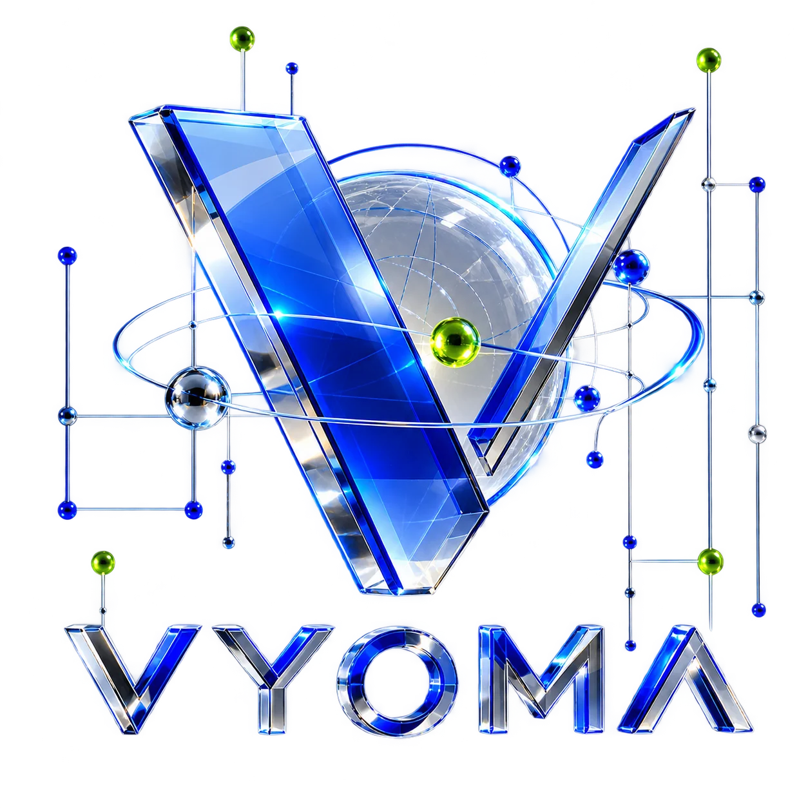

  
  
  <h1>VYOMA</h1>
  
<b>Custom Software, AI & Product Design Agency</b>

  
  

    <a href="https://vyoma.world">vyoma.world</a> • 
    <a href="mailto:support@vyoma.world">support@vyoma.world</a>
  

 

## About Us

VYOMA is a technology agency built for ambitious startups and businesses. We combine **design, engineering, and artificial intelligence** into one connected team to build scalable web apps, mobile products, and intelligent systems. 

We believe in **evidence before promises.** We don't just write code; we design products that solve real problems for real users.

---

## What We Do

### ✦ Product Design (UI/UX)
We design intuitive, high-converting interfaces that users love. From wireframes and prototyping to complete design systems.

### ✦ Custom Software Engineering
Full-stack development for scalable web applications and mobile apps. We specialize in modern tech stacks like Next.js, React, Node, and cloud infrastructure.

### ✦ AI Engineering & Intelligence
Integrating intelligent solutions into modern workflows—from custom LLM integrations and automated agents to smart analytics.

---

## Selected Work

A few of the problems we've solved recently:

- **Menuly**: A fully-featured QR Digital Menu SaaS platform used by restaurants & hotels.
- **Verik QR**: A universal QR campaign manager with dynamic routing.
- **AEI AFPS**: An enterprise-grade, DGMS-approved fire detection & suppression platform.
- **WoyTrip**: A budget-friendly, high-performance tour package booking engine.

*[View all of our case studies here](https://vyoma.world/work).*

---

## Contact

Have a project in mind? We'd love to discuss how we can help bring it to life.

- 🌐 **Website:** [vyoma.world](https://vyoma.world)
- ✉️ **Email:** [support@vyoma.world](mailto:support@vyoma.world)
